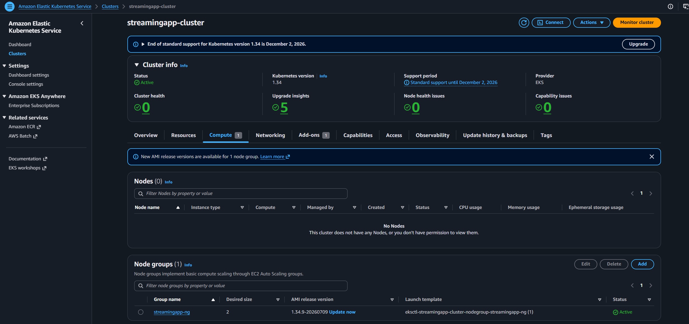

# StreamingApp: Microservices Orchestration and Scaling on Amazon EKS

## Overview

This project takes a microservices-based streaming application from source code to a fully orchestrated, auto-scaling deployment on AWS. The application is composed of a frontend and four independent backend services (Auth, Admin, Chat, and Streaming), backed by MongoDB and fronted by an NGINX load balancer. Each component is containerized, built and pushed to Amazon ECR through a Jenkins CI/CD pipeline, and deployed to an Amazon EKS cluster using Helm. Amazon CloudWatch handles monitoring and centralized logging, and alarm-driven alerts are delivered to Telegram through SNS and Lambda.

Forked from: https://github.com/UnpredictablePrashant/StreamingApp.git

## Technology Stack

  - Docker
  - Amazon ECR
  - Jenkins
  - Amazon EKS
  - Helm
  - kubectl and eksctl
  - NGINX (in-cluster load balancing)
  - Amazon CloudWatch (Observability Add-on, Container Insights, Logs, Alarms)
  - Fluent Bit
  - Amazon SNS
  - AWS Lambda
  - Telegram Bot API
  - AWS CLI
  - MongoDB, Node.js, React (MERN-based microservices)

## System Architecture

The application is composed of five deployable components plus a database, all running as Kubernetes workloads on EKS and fronted by NGINX.

    Developer
      |
      | git push
      v
    GitHub Repository (forked StreamingApp)
      |
      | webhook
      v
    Jenkins (running on EC2)
      |
      |-- Checkout
      |-- Build Docker Images (Frontend, Auth, Admin, Chat, Streaming)
      |-- Push Images to Amazon ECR (one repository per service)
      |-- Deploy to Amazon EKS via Helm
      |-- Verify Rollout
      |
      v
    Amazon EKS Cluster
      |
      |-- NGINX (LoadBalancer / in-cluster reverse proxy)
      |     |
      |     |-- Frontend Service
      |     |-- Auth Service
      |     |-- Admin Service
      |     |-- Chat Service
      |     |-- Streaming Service
      |
      |-- MongoDB (Deployment + Service, persistent storage)
      |
      v
    Running Application (all services auto-scaled independently by HPA)
      |
      |-- CloudWatch Observability Add-on + Container Insights (metrics)
      |-- Fluent Bit -> CloudWatch Logs (centralized logging)
      |-- CloudWatch Alarms
              |
              v
           SNS Topic
              |
              v
           Lambda Function
              |
              v
           Telegram Bot Notification

## Repository Structure

    StreamingApp/
      frontend/
        Dockerfile
      auth-service/
        Dockerfile
      admin-service/
        Dockerfile
      chat-service/
        Dockerfile
      streaming-service/
        Dockerfile
      nginx/
        nginx.conf
      helm/
        streaming-app/             Helm chart covering all services
          templates/
            frontend-deployment.yaml
            auth-deployment.yaml
            admin-deployment.yaml
            chat-deployment.yaml
            streaming-deployment.yaml
            mongodb-deployment.yaml
            nginx-deployment.yaml
      jenkins/
        Jenkinsfile
      lambda/
        telegram-notifier.py       CloudWatch/SNS to Telegram forwarder
      docs/
        architecture-diagram.png
      screenshots/
      README.md

## Step 1: Version Control

  - The main repository was forked into a personal GitHub account.
  - The fork is kept in sync with the upstream repository through a configured upstream remote, allowing updates to be pulled in as needed.

Screenshot 1: Forked Repository
  GitHub repository showing the fork under the personal account, synced with upstream.

## Step 2: Containerizing the Microservices

A separate Dockerfile was written for each independently deployable component of the application:

  - Frontend: builds the React application and serves it through a lightweight web server image.
  - Auth Service: installs Node.js dependencies and exposes authentication and authorization endpoints.
  - Admin Service: installs Node.js dependencies and exposes administrative management endpoints.
  - Chat Service: installs Node.js dependencies and exposes real-time chat functionality.
  - Streaming Service: installs Node.js dependencies and exposes the video/content streaming endpoints.

Each image was built and run locally with Docker to confirm correct behavior before being pushed to a registry.

Screenshot 2: Docker Build - All Services
  Terminal output showing the Frontend, Auth, Admin, Chat, and Streaming images building successfully.

### Pushing Images to Amazon ECR

  - A dedicated private ECR repository was created for each of the five services: frontend, auth-service, admin-service, chat-service, and streaming-service.
  - The AWS CLI was used to authenticate Docker to Amazon ECR.
  - Each image was tagged with its corresponding ECR repository URI and pushed.
  - Image tags follow a consistent versioning scheme tied to the Git commit or Jenkins build number, so any running image can be traced back to its source commit.

Screenshot 3: Amazon ECR Repositories
  ECR console showing all five service repositories with pushed image tags.

## Step 3: AWS Environment Setup

  - AWS CLI was installed and configured with an IAM user's access key and secret key, scoped to the permissions required for ECR, EKS, CloudWatch, SNS, and Lambda.
  - The configured AWS CLI is used both locally and on the Jenkins EC2 instance for all AWS operations in the pipeline.

## Step 4: Continuous Integration and Deployment with Jenkins

  - Jenkins was installed on a dedicated EC2 instance.
  - Required plugins were installed: Git, Pipeline, Docker Pipeline, Kubernetes CLI, and AWS credentials support.
  - AWS credentials, ECR access, and kubeconfig access were added to the Jenkins Credentials Manager rather than hardcoded in the pipeline.

### Jenkins Pipeline Stages

Checkout
  Pulls the latest code from the GitHub repository.

Build Docker Images
  Builds a Docker image for each of the five services: Frontend, Auth, Admin, Chat, and Streaming.

Push Images to Amazon ECR
  Authenticates to Amazon ECR and pushes all five images to their respective repositories.

Deploy to Amazon EKS via Helm
  Runs a helm upgrade --install against the cluster, applying the latest image tags to the Deployments for all services.

Verify Rollout
  Runs kubectl rollout status against each Deployment to confirm all pods reach a ready state before the pipeline reports success.

Trigger
  A GitHub webhook triggers the pipeline automatically on new commits to the repository, so every push results in fresh images being built, pushed, and deployed.

Screenshot 4: Jenkins Pipeline Configuration
  Jenkins job configured with the GitHub webhook trigger and credentials.

Screenshot 5: Jenkins Pipeline Run
  Successful pipeline run showing Checkout, Build, Push to ECR, Deploy via Helm, and Verify Rollout stages.

## Step 5: Kubernetes Deployment on Amazon EKS

  - An EKS cluster was created using eksctl, including a managed node group sized to run all application services concurrently.
  - kubectl was configured to point to the cluster using aws eks update-kubeconfig.
  - A single Helm chart defines the full application, with a Deployment and Service for each of the following components:
      - Frontend
      - Auth Service
      - Admin Service
      - Chat Service
      - Streaming Service
      - MongoDB
      - NGINX
  - MongoDB runs as its own Deployment and Service within the cluster, backing all services that require persistent data.
  - NGINX is deployed as a reverse proxy and load balancer in front of the frontend and backend services, routing external traffic to the correct service based on path.
  - Horizontal Pod Autoscalers are configured on the backend services (Auth, Admin, Chat, and Streaming) so pod count scales independently with CPU or memory load per service.

Screenshot 6: EKS Cluster
  EKS console showing the cluster and node group in an active state.

Screenshot 7: Helm Deployment
  Terminal output of helm upgrade --install completing successfully across all services.

Screenshot 8: Running Pods and Services
  kubectl get pods and kubectl get svc output showing Frontend, Auth, Admin, Chat, Streaming, MongoDB, and NGINX all running.

## Step 6: Monitoring and Logging

  - The Amazon CloudWatch Observability Add-on was enabled on the EKS cluster to collect cluster, node, and pod-level metrics with minimal manual configuration.
  - CloudWatch Container Insights provides dashboards for cluster health, per-service resource utilization, and pod counts.
  - Fluent Bit is deployed as a DaemonSet on the cluster to forward logs from every service to CloudWatch Logs, giving a centralized, per-service view of application logs.
  - CloudWatch Alarms are configured against key metrics, such as high CPU utilization, memory pressure, and pod restart counts, for each service.

Screenshot 9: CloudWatch Container Insights
  CloudWatch dashboard showing cluster and per-service pod-level metrics via the Observability Add-on.

Screenshot 10: CloudWatch Logs
  Centralized logs from all services in CloudWatch Logs, collected via Fluent Bit.

## Step 7: Documentation

  - This README documents the end-to-end architecture and deployment process for all five services.
  - Supporting diagrams and Helm chart references are kept under the docs directory in the repository.
  - Screenshots of each stage of the pipeline and deployment are placed throughout this README, next to the step they demonstrate, and are also stored under the screenshots directory.

## Step 8: Final Validation

  - The frontend was accessed through its NGINX-exposed endpoint and confirmed to load correctly.
  - Auth, Admin, Chat, and Streaming service endpoints were verified independently through the frontend and directly via their exposed routes.
  - Load was generated against individual backend services to confirm their Horizontal Pod Autoscalers scale pod count up and back down independently.

Screenshot 11: Application in Browser
  Frontend loaded in a browser through the NGINX endpoint, communicating with the backend services.

Screenshot 12: Horizontal Pod Autoscaler
  HPA status showing pod counts scaling independently across the backend services under load.

## Step 9 (Bonus): ChatOps Integration

The alerting pipeline forwards infrastructure alarms to a Telegram channel in near real time:

    CloudWatch Alarm -> SNS Topic -> Lambda Function -> Telegram Bot

  - CloudWatch Alarms are configured to publish to an SNS topic whenever a monitored threshold is breached (for example, high CPU usage or pod restarts on any service).
  - The SNS topic invokes a Lambda function, which formats the alarm payload into a readable message.
  - The Lambda function calls the Telegram Bot API to deliver the alert directly to a configured Telegram chat, giving the team real-time visibility into cluster health without needing to check the AWS console.

Screenshot 13: CloudWatch Alarm and SNS Topic
  CloudWatch Alarm configuration and its associated SNS topic.

Screenshot 14: Lambda Function
  Lambda function code and configuration used to forward SNS messages to Telegram.

Screenshot 15: Telegram Alert
  Deployment or alarm notification received in the Telegram chat.

## Environment Variables and Secrets

Secrets are managed through Jenkins Credentials Manager and Kubernetes Secrets, and are never committed to the repository.

  - AWS_ACCESS_KEY_ID and AWS_SECRET_ACCESS_KEY: used by Jenkins and the AWS CLI for ECR, EKS, CloudWatch, SNS, and Lambda access
  - ECR repository URIs for each service: frontend, auth-service, admin-service, chat-service, streaming-service
  - MONGO_URI: MongoDB connection string, injected into the relevant services via a Kubernetes Secret
  - JWT_SECRET: used by the Auth Service for token signing, injected via a Kubernetes Secret
  - SNS_TOPIC_ARN: target topic for CloudWatch alarm notifications
  - TELEGRAM_BOT_TOKEN and TELEGRAM_CHAT_ID: used by the Lambda function to deliver alerts to Telegram

## Submission

  - Forked repository: https://github.com/akashagarwal99-oss/StreamingApp
  - Jenkinsfile: jenkins/Jenkinsfile
  - Helm chart: helm/streaming-app
  - Lambda function: lambda/telegram-notifier.py
  - Documentation: this README, with screenshots inline under each step
  - Screenshots: screenshots/ subdirectory

